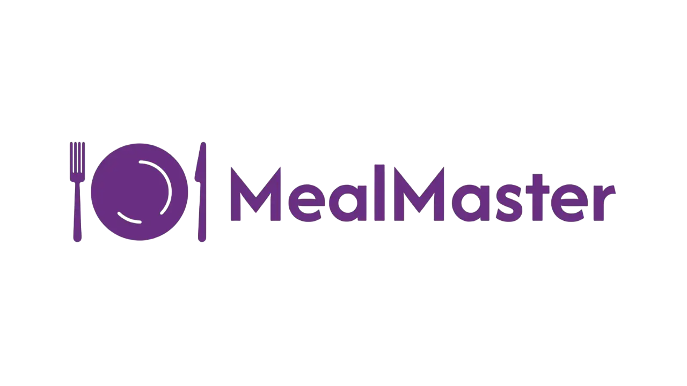
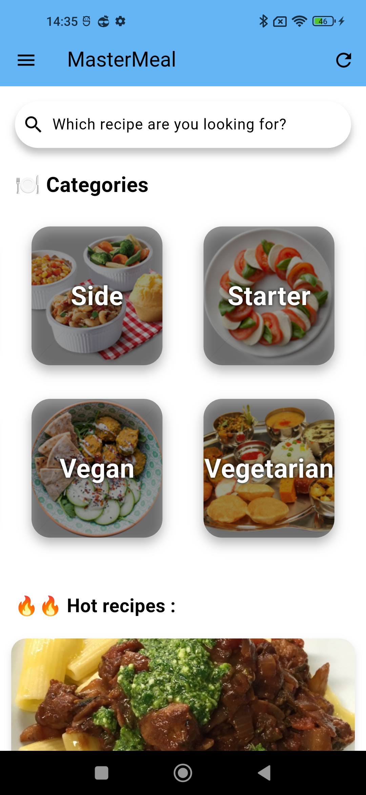
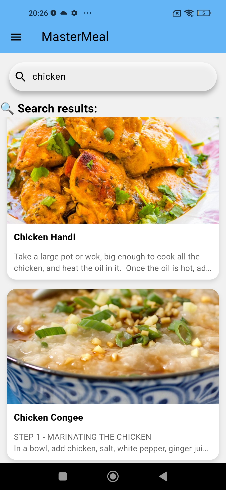
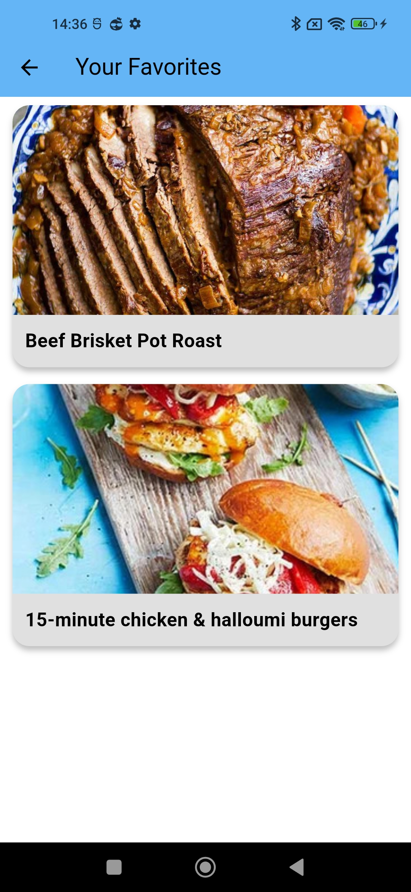
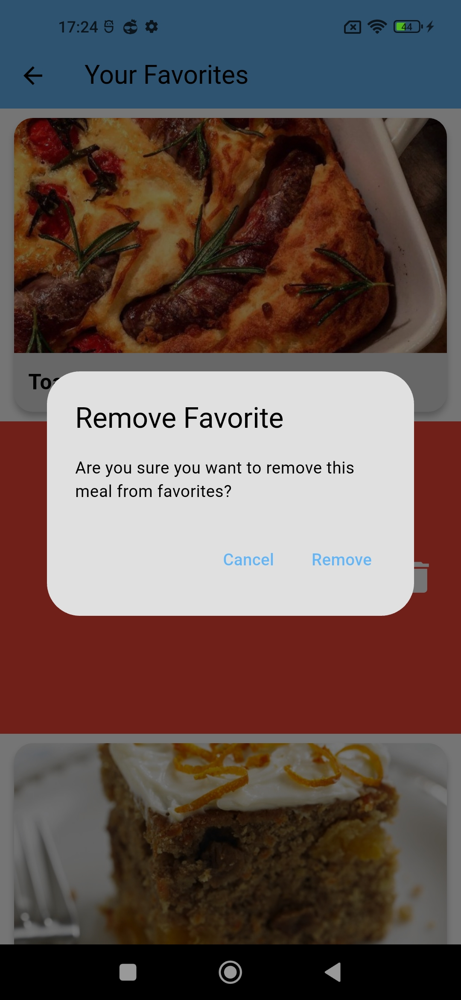
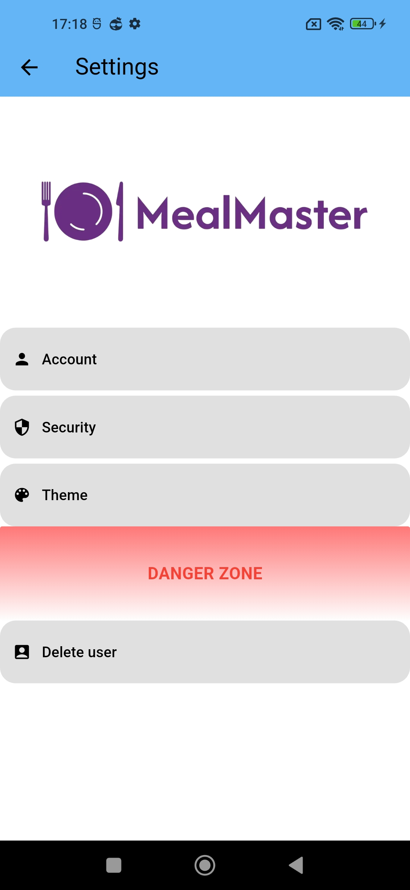
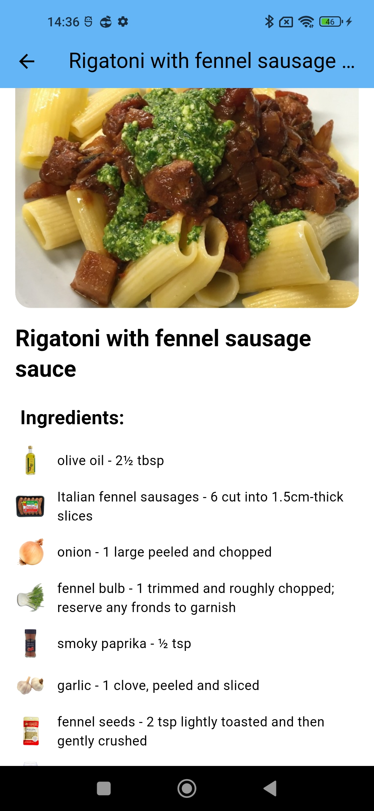

do not forget to star ⭐🌟⭐



**MasterMeal** is a modern and responsive Flutter application that allows users to browse, search, and save their favorite meals. The app integrates with [TheMealDB API](https://www.themealdb.com/) and Firebase for authentication and favorites management.

do not forget to star ⭐🌟⭐

Download the App here:

[](https://github.com/Touti-Sudo/MealMaster/releases/download/v1.0.0/app-release.apk)


---

## ✨ Features

* Firebase Authentication (email & password)
* Meal search by name
* Categories of meals (with category pages)
* Favorites system (with Firestore)
* Light/Dark theme toggle
* YouTube video integration for recipes
* Random daily meal suggestions
* Animated UI with smooth transitions

---

## 🧱 Built With

* [Flutter](https://flutter.dev/)
* [Firebase Auth](https://firebase.google.com/products/auth)
* [Cloud Firestore](https://firebase.google.com/products/firestore)
* [TheMealDB API](https://www.themealdb.com/)
* `provider` for state management
* `shared_preferences` for "Remember me" login

---

## 📸 Screenshots
### Home Page


### Search Page


### Favorites Page



(slide to remove a favorite)


### Settings Page


### Details Page


---

## 🚀 Getting Started

### Prerequisites

* Flutter SDK (>= 3.0.0)
* Firebase project
* Android/iOS setup

### Installation

1. Clone the repo:

```bash
git clone https://github.com/Touti-sudo/mastermeal.git
cd mastermeal
```

2. Install dependencies:

```bash
flutter pub get
```


3. Run the app:

```bash
flutter run
```

## 📂 Project Structure

```
lib/
├── API/
│   └── api.dart
├── components/
│   │── facebook.dart
│   │── goolge.dart
│   └── my_button.dart
├── images/
│   │── facebook.png
│   │── google.png
│   └── icon.png
├── models/
│   └── category.dart
├── pages/
│   │── auth_page.dart
│   │── favorite_page.dart
│   ├── home_page.dart
│   │── login_or_register_page.dart
│   ├── login_page.dart
│   │── meals_by_category_page.dart
│   │── profile_page.dart
│   ├── recipe_detail_page.dart
│   │── register_page.dart
│   │── security_page.dart
│   │── settings_page.dart
│   └── theme_page.dart
├── services/
│   │── auth_service.dart
│   │── category_service.dart
│   └── favorite_service.dart
├── theme/
│   │── providertheme.dart
│   └── theme.dart
├── util/
│   └── firebase_options.dart
│   
└── main.dart
```

---

## 🤝 Contributing

Pull requests are welcome. For major changes, please open an issue first.

---

## 📄 License

This project is licensed under the GNU License. See the [LICENSE](LICENSE) file for details.

---

## 📬 Contact

* Developer: Anes
* Linkedin: Kada Anes
* GitHub: @Touti-Sudo

---

Enjoy cooking with **MasterMeal**!
